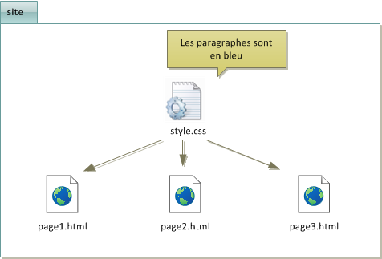
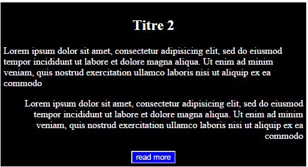
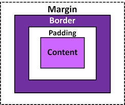
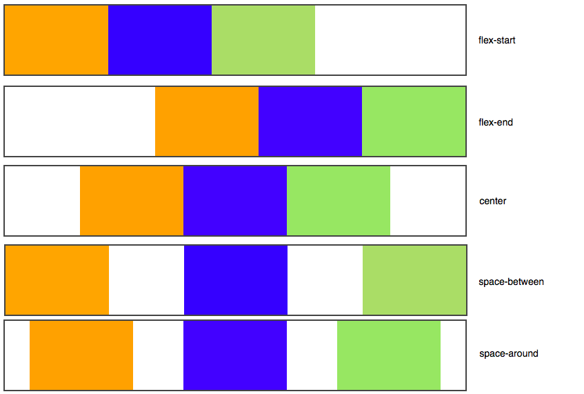
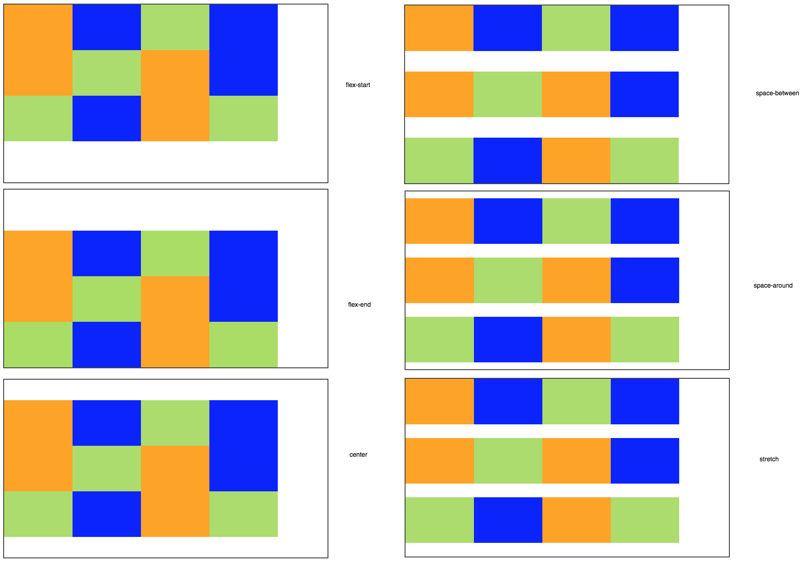

# Cours

## Ressources générales

-   <https://developer.mozilla.org/fr/>
-   <https://www.w3schools.com/>

## HTML (J1)

-   Découverte du langage HTML 
    -   Liste des tags : - <https://developer.mozilla.org/fr/docs/Apprendre/HTML/Cheatsheet#:~:text=Lorsqu'on%20utilise%20HTML%2C%20une,que%20diff%C3%A9rents%20tutoriels%20HTML%20d%C3%A9taill%C3%A9s>.
    -   Cheatsheet pdf (en français !) : <https://olivier-dommange.ch/lib/files/HTML-Sheet.pdf>
-   Mise en oeuvre du HTML pour le projet portfolio

## Mise en page avec CSS (J2)

### Le CSS (Cascading Style Sheets)

-   pour la mise en page
-   avant le CSS : des balises HTML pour la mise en forme, par exemple 
-   avantage du CSS : distinguer le fond de la forme.
-   la question du support des propriétés CSS par les navigateurs :
    <https://www.caniuse.com/>

### 3 manières d'inclure du CSS

-   dans un fichier.css (méthode la plus recommandée), avec lien dans le
    head du document HTML : <link rel="stylesheet" href="style.css" />
-   dans l'en-tête <head> du fichier HTML, avec une balise <style>
-   directement dans les balises du fichier HTML via un attribut style
    (méthode la moins recommandée) : 

### Pourquoi plutôt du CSS dans des fichiers séparés

### Cibler les éléments dans le CSS

-   cibler des tags HTML
-   cibler des class, par exemple : .maclasse
-   cibler des identifiants, par exemple : #monidentifiant

### Cibler les éléments dans le CSS (suite)

-   Cibler plusieurs éléments à la fois : h1, h2
-   \*, le sélecteur universel

### Les commentaires en CSS

    /* Ceci est un commentaire */

### CSS (suite) : formater du texte

-   la taille avec font-size
    -   taille absolue (px) vs taille relative (em, rem)
-   la police, avec font-family
    -   mentionner des polices alternatives : font-family: police1,
        police2, police3, police4;
    -   polices personnalisées avec @font-face. Quelques sources :
        fontsquirrel.com, dafont.com, Google fonts
-   l'italique, avec font-style : normal, italic, oblique
-   le gras, avec font-weight : normal, bold
-   d'autres décorations, avec text-decoration : underline,
    line-through, underline, blink (!), none
-   l'alignement, avec text-align : left, right, center, justify

### Exemple de "magasin" de polices

<https://fonts.google.com/>

### CSS (suite) : la couleur

-   la couleur de texte avec color
    -   nom de la couleur (en anglais) : 16 noms en tout
    -   la notation hexadécimale : un dièse (#), suivi de six lettres ou
        chiffres allant de 0 à 9 et de A à F (quantité de rouge, quantité
        de vert, quantité de bleu)
    -   la méthode RGB (Rouge-Vert-Bleu s'écrit Red-Green-Blue), avec des
        chiffres compris entre 0 et 255, par exemple color:
        rgb(240,96,204)
    -   Outils :  
        -   <http://www.colorpicker.com>
        -   <https://htmlcolorcodes.com/fr/>
-   la couleur du fond avec background-color

### Image de fond avec background-image

-   Par exemple : background-image: url("neige.png");
-   Options : 
    -   fixation, avec background-attachment : fixed ou scroll
    -   la répétition du fond avec background-repeat: no-repeat, repeat-x,
        repeat-y, repeat
    -   la position avec background-position : top, bottom, center, left,
        right (combinables, par exemple background-position: top right;)
    -   une écriture plus synthétique : background: url("soleil.png")
        fixed no-repeat top right;
    -   pas seulement pour body !

### Exercice (voir également sur Teams)

-   Un background de couleur noire, avec une largeur de 500px ,un
    retrait de 5px, et un alignement centré pour l’élément identifié
    par "layout".
-   Alignement du texte à gauche pour le paragraphe 1 et à droite pour
    le second.
-   Couleur de texte blanche pour les éléments h2 , p et button.
-   Couleur bleue pour le background du bouton

### 

A remettre sur Teams

### L'opacité, avec opacity

-   La propriété opacity, très simple, permet d'indiquer le niveau
    d'opacité (c'est l'inverse de la transparence).
-   1 (opacité totale), 0 (transparence totale)
-   avec RGBa : background-color: rgba(255, 0, 0, 0.5); *\* Fond rouge à
    moitié transparent \**

### Ressources complémentaires

-   Introduction au CSS :
    <https://developer.mozilla.org/fr/docs/Learn/CSS/First_steps>

-   Styliser le texte :
    <https://developer.mozilla.org/fr/docs/Learn/CSS/Styling_text>

-   CSS de base
    
    -   Liste des propriétés : 
        -   <https://www.cssdebutant.com/debuter-en-css-les-definitions-css.html>
        -   <http://goulvench.free.fr/vrac/CSS.html>
    
    -   Magasin de polices :
        -   <https://fonts.google.com/>
        -   <https://fonts.adobe.com/fonts>
        -   <https://www.fontsquirrel.com/>

### Exercice

-   Gérez les polices de votre site Web.
-   Mettez le texte de votre site web en forme.
-   Si vous le désirez, ajoutez un arrière-plan.

## CSS box model (J2)

### 

### Les bordures

-   en notation synthétique : border: 3px blue dashed;
-   dans l'ordre : largeur, couleur, type de bordure (none, solid, dotted, dashed, double, groove, ridge, inset, outset)

### Les bordures (suite)

-   position : border-left, border-right, border-top, border-bottom. Par
    exemple : border-left: 2px solid black;
-   bordures arrondies avec border-radius, par exemple : border-radius: 10px;
    -   si on veut préciser les différents coins : border-radius: 10px 5px
        10px 5px; (haut gauche, haut droite, bas droite, bas gauche)

### Les marges

-   padding pour la marge intérieure
-   margin pour la marge extérieure.

### Exemple

    p {
       width: 350px;
       border: 1px solid black;
       text-align: justify;
       padding: 12px;
       margin: 50px; /* Marge extérieure de 50px */
    }

### Les marges (suite)

-   notation synthétique : top bottom left right
-   Et aussi margin: 2px 1px (2px pour top et bottom, 1px pour gauche et
    droite)
-   margin-top, margin-bottom, margin-left, margin-right. Idem pour padding

### Ressources complémentaires

-   Le modèle de boîte :
    <https://developer.mozilla.org/fr/docs/Apprendre/CSS/Building_blocks>

### Les ombres avec box-shadow

-   Par exemple : box-shadow: 6px 6px 0px black; /\* le décalage
    horizontal de l'ombre ; le décalage vertical de l'ombre ;
    l'adoucissement du dégradé ; la couleur de l'ombre \*/

### Les pseudo-formats

-   Permettent de changer l'apparence 
    -   au survol, avec :hover
    -   lors du clic, avec :active
    -   lors du focus, avec :focus,
    -   lorsqu'un lien a été consulté, avec :visited

### Une note sur les images

-   rappel : utilisation des attributs width et heigth directement dans
    le HTML, avec le tag 
-   en CSS, les propriétés max-width: 100% et height: auto pour des
    images "responsives"
-   la propriété CSS object-fit pour déterminer la manière dont l'image
    doit s'adapter à sa boîte :
    <https://developer.mozilla.org/fr/docs/Web/CSS/object-fit>

### Exercice CSS sur CV

Je vous demande de repartir du fichier HTML que vous aviez créé et de
lui ajouter les effets (a minima) de style suivants :

-   Changer la couleur d'un des textes
-   Changer l'alignement d'un des textes
-   Appliquer une image de fond (à la page ou à une div)
-   Utiliser une police personnalisée via @font-face
-   Définir une bordure à un élément
-   Définir une ombre à un élément

Et de manière plus générale, mettez en forme les blocs de votre CV
(l'organisation des blocs sur la page sera la thématique de la session suivante).

## Mettre en page les blocs

### La gestion des blocs

-   Une page web peut être vue comme une succession et un empilement de
    boîtes, qu'on appelle « blocs ».

### Historique

Plusieurs façons de mettre en page un site : 

-   Au début, les webmasters utilisaient des tableaux HTML pour faire la
    mise en page (à ne plus faire aujourd'hui !).
-   Puis, CSS est apparu et on a commencé à faire une mise en page à
    l'aide de la propriété float.
-   Une autre technique, plus pratique, a consisté à créer des éléments
    de type inline-block sur la page
-   Aujourd'hui, il existe 2 modules CSS qui facilitent ce travail de
    mise en page et ils sont à privilégier : Grid CSS et Flexbox.

### Différences Grid et Flexbox

-   Grid CSS permet une mise en 2 dimensions. Ce module est adapté à la
    mise en forme générale des pages.
-   Flexbox permet une mise en forme sur une seule dimension. Ce module
    est adapté à la gestion des items au sein d'un bloc.

## Mise en page avec Grid CSS

A partir de quelques exemples simples

### Display : grid

### Les unités

fr, %, vh/vw, em/rem, fr

### Le principe de base

-   On définit une grille avec 
    -   un nombre de colonnes (grid-template-columns), et
    -   un nombre de lignes (grid-template-rows).
-   Pour chaque élément, on indique les cellules qu'il va occuper sur
    cette grille avec 
    
    -   grid-column-start, grid-column-end, grid-row-start,
        grid-row-end, ou
    
    -   grid-column, grid-row

### Les options et alternatives

-   des zones nommées avec grid-area et grid-template-areas:
-   un espace entre les colonnes et/ou les lignes :
    grid-gap, (grid-)row-gap, (grid-)column-gap
-   repeat(nbre de fois, taille) et minmax()
-   grid-auto-flow

### Alignement des boîtes au sein du conteneur

Avec

-   align-content, et
-   justify-content

### Alignement collectif du contenu au sein de la boîte

Avec

-   align-items, et
-   justify-items

### Alignement individuel du contenu au sein d'une boîte

Avec

-   align-self, et
-   justify-self

### Resources

-   Une excellent cheatsheet :
    <https://github.com/alsacreations/guidelines/blob/master/grid-cheatsheet.pdf>
-   MDN :
    <https://developer.mozilla.org/fr/docs/Apprendre/CSS/CSS_layout/Grids>
-   Des exemples : <https://gridbyexample.com/learn/>
-   Un jeu : <https://cssgridgarden.com/#fr>
-   Un autre guide très complet : <https://la-cascade.io/css-grid-layout-guide-complet/>

### Exercice

Reproduire une mise en page (voir dossier J3)

## Mise en page avec Flexbox

### Le principe de Flexbox

-   Comme pour Grid CSS, un conteneur et, à l'intérieur, plusieurs éléments

    

        
Elément 1

        
Elément 2

        
Elément 3

    

-   Et on ajoute display: flex au conteneur

    #conteneur
    {
        display: flex;
    }

### Flexbox (suite)

-   La direction avec flex-direction, avec les options :
    -   row : organisés sur une ligne (par défaut)
    -   column : organisés sur une colonne
    -   row-reverse : organisés sur une ligne, mais en ordre inversé
    -   column-reverse : organisés sur une colonne, mais en ordre inversé

### Flexbox (suite)

-   Le retour à la ligne avec flex-wrap
    -   nowrap : pas de retour à la ligne (par défaut)
    -   wrap : les éléments vont à la ligne lorsqu'il n'y a plus la place
    -   wrap-reverse : les éléments vont à la ligne lorsqu'il n'y a plus la place en sens inverse

### Flexbox (suite)

-   notions d'axe principal et d'axe secondaire : 
    -   Si vos éléments sont organisés horizontalement, l'axe secondaire
        est l'axe vertical.
    -   Si vos éléments sont organisés verticalement, l'axe secondaire est
        l'axe horizontal.

### Flexbox (suite)

-   alignement sur l'axe principal avec justify-content : 
    -   flex-start : alignés au début (par défaut)
    -   flex-end : alignés à la fin
    -   center : alignés au centre
    -   space-between : les éléments sont étirés sur tout l'axe (il y a de
        l'espace entre eux)
    -   space-around : idem, les éléments sont étirés sur tout l'axe, mais
        ils laissent aussi de l'espace sur les extrémités

### Flexbox (suite)

### Flexbox (suite)

-   alignement sur l'axe secondaire, avec align-items : 
    -   stretch : les éléments sont étirés sur tout l'axe (valeur par
        défaut)
    -   flex-start : alignés au début
    -   flex-end : alignés à la fin
    -   center : alignés au centre
    -   baseline : alignés sur la ligne de base (semblable à flex-start)

### Ressource

-   Excellent cheatsheet : <https://yoksel.github.io/flex-cheatsheet/>

### Flexbox (suite)

-   Aligner un seul élément avec align-self (sur l'axe secondaire)

    #conteneur
    {
        display: flex;
        flex-direction: row;
        justify-content: center;
        align-items: center;
    }
    
    .element:nth-child(2) /* On prend le deuxième bloc élément */
    {
        background-color: blue;
        align-self: flex-end; /* Seul ce bloc sera aligné à la fin */
    }
    
    /* ... */

### Aligner plusieurs lignes, avec align-content

Les options : 

-   flex-start : les éléments sont placés au début
-   flex-end : les éléments sont placés à la fin
-   center : les éléments sont placés au centre
-   space-between : les éléments sont séparés avec de l'espace entre
    eux
-   space-around : idem, mais il y a aussi de l'espace au début et à
    la fin
-   stretch (par défaut) : les éléments s'étirent pour occuper tout
    l'espace

### 

### Gérer l'ordre avec Flex et la propriété order

    .element:nth-child(1)
    {
        order: 3;
    }
    .element:nth-child(2)
    {
        order: 1;
    }
    .element:nth-child(3)
    {
        order: 2;
    }

### Faire grossir ou maigrir les éléments avec Flex

propriété "flex"

    .element:nth-child(2)
    {
        flex: 1;
    }

Le nombre que vous indiquez à la propriété flex indique dans quelle
mesure il peut grossir par rapport aux autres.

### 

    .element:nth-child(1)
    {
        flex: 2;
    }
    .element:nth-child(2)
    {
        flex: 1;
    }

### align-items vs align-content

<https://medium.com/better-programming/flexbox-align-items-and-align-content-a60b6f8451e3>

### Ressources

-   Cours MDN :
    <https://developer.mozilla.org/fr/docs/Apprendre/CSS/CSS_layout/Flexbox>
-   <https://bocoup.com/blog/dive-into-flexbox>

### Exercice Flexbox

Reproduisez la mise en page du menu (voir dossier J3)

### Exercice CV / portfolio

-   Utilisez Grid CSS pour la mise en page générale de votre projet
-   Utilisez Flexbox a minima pour la mise en page du menu de navigation
    de votre projet

